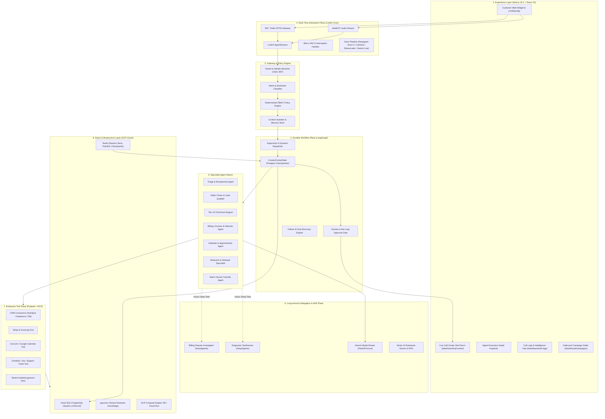
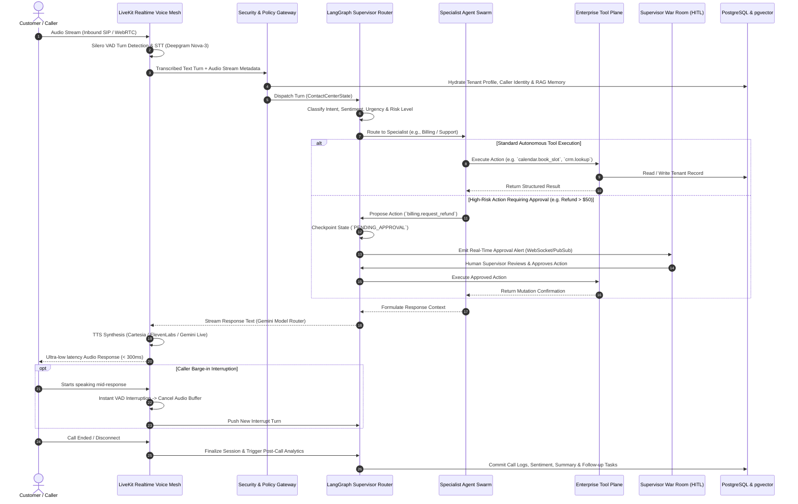
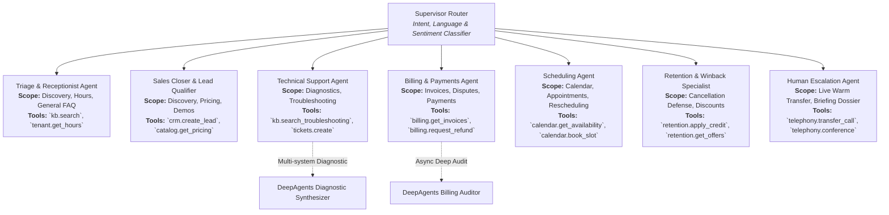
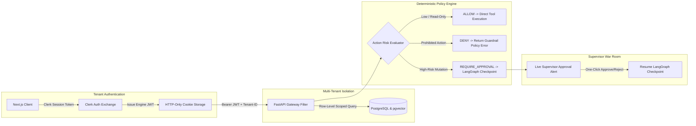

# Omniweb AI — Enterprise Autonomous Voice & Agentic Contact Center

<div align="center">


[](https://nextjs.org/)
[](https://fastapi.tiangolo.com/)
[](https://www.python.org/)
[](https://livekit.io/)
[](https://langchain-ai.github.io/langgraph/)
[](https://ai.google.dev/)
[](https://www.postgresql.org/)
[](https://cloud.google.com/)

**Production-grade, multi-tenant autonomous AI contact center platform combining low-latency LiveKit real-time voice streaming with durable LangGraph multi-agent orchestration, human-in-the-loop governance, tenant-isolated RAG, and GCP cloud scalability.**

[Live Demo](https://omniweb.ai/demo) • [Architecture Docs](./docs/architecture/target-state.md) • [ADRs](./docs/adr/) • [Deployment Guide](./scripts/deploy-gcp-vm.sh)

</div>

---

## 📑 Table of Contents

- [Overview & Architecture](#-overview--architecture)
  - [1. System Topology](#1-system-topology)
  - [2. Voice & Interaction Lifecycle](#2-voice--interaction-lifecycle)
  - [3. Multi-Agent Swarm Hierarchy](#3-multi-agent-swarm-hierarchy)
  - [4. Security, Multi-Tenancy & HITL Governance](#4-security-multi-tenancy--hitl-governance)
- [Key Features & Capabilities](#-key-features--capabilities)
- [Repository Structure](#-repository-structure)
- [Quickstart & Local Development](#-quickstart--local-development)
  - [Prerequisites](#prerequisites)
  - [1. Environment Configuration](#1-environment-configuration)
  - [2. Frontend Application Setup](#2-frontend-application-setup)
  - [3. Backend Engine Setup](#3-backend-engine-setup)
  - [4. LiveKit Real-Time Voice Agent](#4-livekit-real-time-voice-agent)
- [Production Deployment](#-production-deployment)
  - [GCP Compute Engine VM (Automated)](#gcp-compute-engine-vm-automated)
  - [Docker Compose Deployment](#docker-compose-deployment)
  - [GCP Cloud Run & Cloud SQL](#gcp-cloud-run--cloud-sql)
- [Environment Variables Matrix](#-environment-variables-matrix)
- [Architectural Decision Records (ADRs)](#-architectural-decision-records-adrs)
- [Enterprise Tool Registry](#-enterprise-tool-registry)
- [Observability & Telemetry](#-observability--telemetry)
- [Contributing & License](#-contributing--license)

---

## 🏛 Overview & Architecture

Omniweb AI decouples real-time voice transport from durable workflow orchestration and deep analytical delegation across **four strictly separated planes**:

1. **Real-Time Interaction Plane (LiveKit):** Manages ultra-low-latency WebRTC and SIP telephony audio streaming (< 300ms), Silero Voice Activity Detection (VAD), and turn-taking with instant barge-in interruption.
2. **Durable Workflow Plane (LangGraph):** Orchestrates conversation state, dynamic intent classification, specialist routing, PostgreSQL checkpointing, retries, and failure recovery.
3. **Specialist Agent Services (Google Gemini & ADK):** Powers Gemini 2.0 Flash / Pro multimodal reasoning, intelligent model routing, and Google Agent Development Kit enterprise tools.
4. **Long-Horizon Delegation Plane (DeepAgents):** Asynchronously delegates complex, multi-stage investigations (historical billing disputes, technical root-cause synthesis, retention strategies) without blocking live phone interactions.

---

### 1. System Topology



---

### 2. Voice & Interaction Lifecycle

The sequence diagram below illustrates an inbound phone or WebRTC interaction with real-time intent classification, specialist delegation, tool execution, and human approval:



---

### 3. Multi-Agent Swarm Hierarchy



---

### 4. Security, Multi-Tenancy & HITL Governance



---

## 🚀 Key Features & Capabilities

| Capability | Technical Implementation | Highlights |
|---|---|---|
| **Ultra-Low-Latency Voice** | LiveKit AgentSession + Silero VAD | < 300ms turnaround, instant barge-in cancellation, WebRTC & SIP/PSTN |
| **Durable Agent Workflows** | LangGraph + AsyncPostgresSaver | Deterministic state machine, multi-turn memory, resilient to disconnects |
| **Specialist Swarm** | Modular Python Agents | 7 bounded specialists (Triage, Sales, Support, Billing, Scheduling, Retention, Escalation) |
| **Human-in-the-Loop** | Policy Engine + Supervisor War Room | High-risk action gating, live call monitor, supervisor takeover & warm transfer |
| **Deep Task Delegation** | DeepAgents Async Engine | Multi-step background investigations for complex billing/technical tickets |
| **Intelligent Model Routing** | Gemini 2.0 Flash / Pro + OpenAI fallback | Cost and latency-optimized routing based on task cognitive complexity |
| **Tenant-Isolated RAG** | pgvector + Semantic Chunking | Strict tenant boundary enforcement, sub-50ms knowledge retrieval |
| **Outbound Campaign Dialer** | Multi-channel dialer & scheduler | TCPA-compliant dialer with agent fleet management and conversion metrics |
| **Production Cloud Ready** | GCP VM, Cloud Run & Terraform | Automated provisioning script, Caddy reverse proxy, zero-downtime containers |

---

## 📂 Repository Structure

```text
.
├── app/                                    # Next.js 16.2 (App Router) Frontend
│   ├── dashboard/                          # SaaS & Contact Center Dashboards
│   │   ├── call-center/                    # Live Call Center War Room & Fleet Manager
│   │   ├── call-logs/                      # Call Intelligence, Transcripts & Analytics
│   │   └── campaigns/                      # Outbound Campaign Dialer & Sequences
│   ├── demo/                               # Interactive Live Call Center Studio Demo
│   ├── get-started/                        # Clerk Multi-Tenant Sign-Up Flow
│   ├── signin/                             # Clerk Sign-In Flow
│   └── layout.tsx                          # Root Application Shell & Telemetry Provider
│
├── backend/                                # FastAPI 0.115 Production Agent Engine
│   ├── app/
│   │   ├── api/routes/                     # REST Endpoints (Auth, Calls, Analytics, Tools)
│   │   ├── core/                           # Config, Security, DB Engine & OpenTelemetry
│   │   ├── models/                         # SQLAlchemy 2.0 PostgreSQL Domain Models
│   │   ├── orchestration/                  # Multi-Agent Workflow Core
│   │   │   ├── adk/                        # Google Agent Development Kit Adapter
│   │   │   ├── deepagents/                 # Long-Horizon Delegation Engine
│   │   │   ├── langgraph/                  # State Graph, Checkpointer & Routing Nodes
│   │   │   └── model_router.py             # Gemini 2.0 Flash/Pro Intelligent Router
│   │   ├── policies/                       # RBAC & Human-in-the-Loop Policy Engine
│   │   ├── tools/                          # Enterprise Tool Registry & MCP Connectors
│   │   │   ├── billing/                    # Stripe, Invoices & Refund Tools
│   │   │   ├── calendar/                   # Cal.com & Google Calendar Tools
│   │   │   ├── crm/                        # Customer & Lead Records Tools
│   │   │   ├── knowledge/                  # pgvector Tenant-Isolated Search
│   │   │   └── ticketing/                  # Support Ticket Management Tools
│   │   └── voice/                          # LiveKit Realtime Voice Agent & Pipelines
│   └── tests/                              # Automated Pytest Suite & Foundation Verification
│
├── components/                             # Reusable React 19 UI Components
│   ├── call-center/                        # War Room, Live Simulator & Graph Inspector
│   ├── admin/                              # Tenant & Team Admin Consoles
│   └── saas/                               # Dashboard Shell, Cards & UI Primitives
│
├── docs/                                   # Architectural Documentation & Runbooks
│   ├── adr/                                # Architecture Decision Records (ADR 001 - 010)
│   └── architecture/                       # Target State, Current Assessment & Migration Plan
│
├── infra/                                  # Infrastructure as Code (IaC)
│   ├── caddy/                              # Caddy Reverse Proxy & TLS Configuration
│   ├── k8s/                                # Kubernetes Deployment Manifests
│   └── terraform/                          # Terraform GCP Cloud SQL & Cloud Run Configs
│
├── scripts/                                # Automation & Operations Scripts
│   └── deploy-gcp-vm.sh                    # Automated 1-Click GCP VM Deployment Script
│
├── Dockerfile                              # Multi-stage Production Docker Build
├── docker-compose.gcp.yml                  # Full-stack GCP Production Compose Orchestration
├── pyrightconfig.json                      # Python Type Checking Configuration
└── README.md                               # Project Documentation & Architecture Guide
```

---

## ⚡ Quickstart & Local Development

### Prerequisites

- **Node.js**: `v20.x` or `v22.x` + `pnpm` (`v9.x+`)
- **Python**: `3.12+` with `uv` or `pip`
- **PostgreSQL**: `15+` with `pgvector` extension enabled
- **Redis**: `7.0+`
- **API Keys**: Clerk, Google Gemini, and LiveKit credentials

---

### 1. Environment Configuration

Copy the sample environment configuration:

```bash
# Frontend environment
cp .env.local.example .env.local

# Backend / GCP production environment
cp .env.gcp.example .env.gcp
```

Fill in your respective API keys in `.env.local` and `.env.gcp`.

---

### 2. Frontend Application Setup

```bash
# Install dependencies
pnpm install

# Run Next.js local development server
pnpm dev
```

Open [http://localhost:3000](http://localhost:3000) to access the landing pages and dashboard.

---

### 3. Backend Engine Setup

```bash
# Navigate to backend and create virtual environment
cd backend
python3 -m venv .venv
source .venv/bin/activate

# Install dependencies
pip install -r requirements.txt

# Run database migrations
alembic upgrade head

# Start FastAPI backend engine
uvicorn app.main:app --host 0.0.0.0 --port 8000 --reload
```

The FastAPI OpenAPI Swagger documentation will be available at [http://localhost:8000/docs](http://localhost:8000/docs).

---

### 4. LiveKit Real-Time Voice Agent

To run the LiveKit real-time voice pipeline worker:

```bash
cd backend
python -m app.voice.livekit_agent dev
```

---

## 🚢 Production Deployment

### GCP Compute Engine VM (Automated)

The project includes an automated deployment script [`scripts/deploy-gcp-vm.sh`](file:///Users/banjahmarah/v0-omniweb-landing-page-1/scripts/deploy-gcp-vm.sh) for single-command GCP VM provisioning:

```bash
# Run automated GCP VM setup & launch
chmod +x scripts/deploy-gcp-vm.sh
./scripts/deploy-gcp-vm.sh
```

The script automatically:
1. Installs Docker, Docker Compose, and Git.
2. Clones the repository and verifies configurations.
3. Provisions PostgreSQL with `pgvector`, Redis, FastAPI Engine, Next.js UI, and Caddy TLS proxy.
4. Validates health check endpoints on port `80` and `443`.

---

### Docker Compose Deployment

To run the complete production stack using Docker Compose:

```bash
# Launch all containers in detached mode
docker compose -f docker-compose.gcp.yml --env-file .env.gcp up -d --build

# Inspect container status
docker compose -f docker-compose.gcp.yml ps

# View live system logs
docker compose -f docker-compose.gcp.yml logs -f
```

---

### GCP Cloud Run & Cloud SQL

For serverless enterprise auto-scaling:
- Use [`infra/terraform/main.tf`](file:///Users/banjahmarah/v0-omniweb-landing-page-1/infra/terraform/main.tf) to provision Google Cloud SQL (PostgreSQL 16 with pgvector) and Google Cloud Memorystore (Redis).
- Build and push container images to Google Artifact Registry:
  ```bash
  gcloud builds submit --tag gcr.io/$PROJECT_ID/omniweb-engine:latest .
  ```
- Deploy to Cloud Run with auto-scaling (0-100 instances).

---

## 🔑 Environment Variables Matrix

| Variable | Category | Required | Purpose |
|---|---|---|---|
| `NEXT_PUBLIC_CLERK_PUBLISHABLE_KEY` | Auth | Yes | Clerk publishable key for client sign-in |
| `CLERK_SECRET_KEY` | Auth | Yes | Clerk backend authentication secret |
| `DATABASE_URL` | Database | Yes | PostgreSQL connection string (`postgresql+asyncpg://...`) |
| `REDIS_URL` | Cache | Yes | Redis connection string (`redis://...`) |
| `SECRET_KEY` | Security | Yes | Secret used for JWT token signing & encryption |
| `INTERNAL_API_KEY` | Security | Yes | Inter-service API authentication key |
| `GEMINI_API_KEY` | AI Model | Yes | Google Gemini 2.0 Flash / Pro API key |
| `OPENAI_API_KEY` | AI Model | Optional | OpenAI GPT-4o fallback model key |
| `LIVEKIT_URL` | Telephony | Yes | LiveKit server WebSocket URL (`wss://...`) |
| `LIVEKIT_API_KEY` | Telephony | Yes | LiveKit API Key for room tokens |
| `LIVEKIT_API_SECRET` | Telephony | Yes | LiveKit API Secret for authentication |
| `DEEPGRAM_API_KEY` | Audio/STT | Optional | Deepgram Nova-3 real-time speech transcription |
| `CARTESIA_API_KEY` | Audio/TTS | Optional | Cartesia ultra-low latency voice synthesis |
| `STRIPE_SECRET_KEY` | Billing | Optional | Stripe payments and subscription checkout |
| `TWILIO_ACCOUNT_SID` | Telephony | Optional | Twilio SIP trunking and SMS delivery |
| `ENABLE_LANGGRAPH` | Flag | Yes | Enable LangGraph multi-agent orchestration |
| `ENABLE_LIVEKIT` | Flag | Yes | Enable LiveKit real-time voice interaction plane |
| `ENABLE_HUMAN_HANDOFF` | Flag | Yes | Enable Supervisor War Room approval gates |

---

## 📜 Architectural Decision Records (ADRs)

All foundational architectural decisions are formally documented in [`docs/adr/`](./docs/adr/):

- **[ADR-001: Layered Agent Orchestration Architecture](./docs/adr/ADR-001-agent-orchestration.md)** — 4-plane separation of concerns.
- **[ADR-002: Real-Time Audio Transport via LiveKit](./docs/adr/ADR-002-livekit-realtime.md)** — Low-latency WebRTC/SIP media plane.
- **[ADR-003: Durable Workflows with LangGraph](./docs/adr/ADR-003-langgraph-workflows.md)** — Deterministic state graphs and Postgres checkpointer.
- **[ADR-004: Long-Horizon Delegation with DeepAgents](./docs/adr/ADR-004-deepagents-delegation.md)** — Asynchronous research and investigations.
- **[ADR-005: Google Agent Development Kit & Gemini 2.0](./docs/adr/ADR-005-google-adk.md)** — Multimodal reasoning and grounding.
- **[ADR-006: Dynamic Model Routing](./docs/adr/ADR-006-model-routing.md)** — Cognitive complexity and latency optimization.
- **[ADR-007: Tiered Agent Memory Architecture](./docs/adr/ADR-007-memory.md)** — In-turn, semantic episodic, and entity memory.
- **[ADR-008: Multi-Tenancy & Tenant Data Isolation](./docs/adr/ADR-008-multitenancy.md)** — Row-level security and isolated vector search.
- **[ADR-009: Human-in-the-Loop & Supervisor Console](./docs/adr/ADR-009-human-in-loop.md)** — Policy engine and approval gates.
- **[ADR-010: Production Deployment on GCP](./docs/adr/ADR-010-gcp-deployment.md)** — GCP VM, Cloud Run, Cloud SQL, and Caddy.

---

## 🛠 Enterprise Tool Registry

Tools are registered with strict Pydantic parameter schemas, execution risk ratings, and tenant RBAC enforcement in [`backend/app/tools/`](file:///Users/banjahmarah/v0-omniweb-landing-page-1/backend/app/tools/):

```python
from app.tools.registry import register_tool, ToolRiskLevel

@register_tool(
    name="billing.request_refund",
    description="Submit a customer refund request for supervisor approval",
    risk_level=ToolRiskLevel.HIGH_RISK,
    requires_approval=True
)
async def request_refund(tenant_id: str, customer_id: str, amount_usd: float, reason: str):
    # Enforces approval gate before financial mutation
    ...
```

---

## 📊 Observability & Telemetry

Omniweb AI incorporates end-to-end tracing and real-time telemetry across every interaction turn:
- **Trace Context:** Every turn propagates `tenant_id`, `session_id`, `call_id`, and `agent_id`.
- **Latency Tracking:** Real-time metrics on STT latency, Time-to-First-Token (TTFT), Tool Execution Duration, and TTS synthesis.
- **Supervisor War Room:** Live dashboard streaming agent execution graphs, sentiment trends, queue depths, and ROI analytics.

---

## 📄 License & Maintainers

Maintained with ❤️ by the **Omniweb AI Engineering Team**.  
Licensed under the [MIT License](LICENSE).
