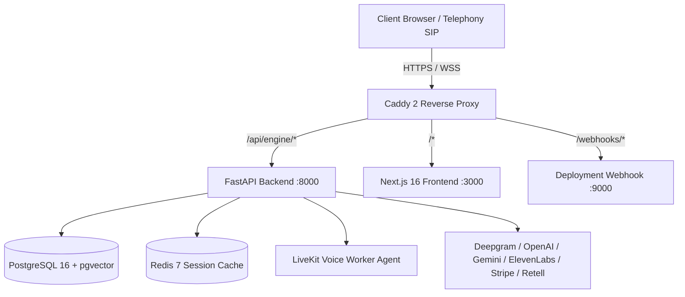

# Current Architecture: Omniweb AI

## 1. Executive Summary
Omniweb.ai is currently an AI-powered voice and chat receptionist/contact center platform designed for businesses (contractors, healthcare, local services, e-commerce). The system is implemented as a **modular monolith** with a modern Next.js 16 frontend and an asynchronous FastAPI backend running on Python 3.11+. It integrates LiveKit for WebRTC telephony and low-latency voice, Deepgram for speech-to-text, OpenAI/Gemini for LLM intelligence, PostgreSQL with pgvector for storage, and Redis for session cache and pub/sub.

---

## 2. System Topology & Infrastructure

- **Deployment Host**: Google Cloud Platform (GCP) Compute Engine VM (`136.114.167.50`).
- **Reverse Proxy**: Caddy 2 with automatic Let's Encrypt / ZeroSSL TLS terminating for `omniweb.ai` and fallback on IP.
- **Container Orchestration**: `docker-compose.gcp.yml` defining services:
  - `postgres`: pgvector/pgvector:pg16 with vector indexing extensions.
  - `redis`: redis:7-alpine with password authentication and AOF persistence.
  - `backend`: FastAPI app with Uvicorn worker pool.
  - `agent-worker`: LiveKit Python voice agent runtime (`agent/agent.py`).
  - `frontend`: Next.js 16 standalone production container.
  - `caddy`: Caddy 2 reverse proxy.
- **CI/CD**: Lightweight zero-cost GitHub webhook receiver listening on port 9000 for push events to `main`, pulling and rebuilding containers automatically.

---

## 3. Backend Architecture (`backend/app/`)

### 3.1 API Routing (`backend/app/api/routes/`)
The FastAPI application exposes 29 domain routers under `/api/engine`:
- `auth.py`: JWT-based authentication, user registration, client login, password reset, and API key verification.
- `agent.py` & `agent_config.py`: Autonomous agent configuration, prompt templates, tool binding, and voice parameters.
- `calls.py`: Call recording metadata, transcript inspection, and audio stream proxying.
- `chat.py`: Streaming conversational chat endpoint for web widget and internal assistant.
- `livekit.py`: LiveKit room token generation, SIP trunk dispatching, and WebRTC session management.
- `leads.py` & `automations.py`: Inbound lead capture, qualification status, and outbound workflow triggers.
- `shopify.py`: E-commerce catalog sync, order tracking, and discount approval handling.
- `analytics.py`: Telephony minute metering, conversion metrics, and call sentiment statistics.
- `webhooks.py`, `webhooks_stripe.py`, `webhooks_tools.py`: Inbound webhook dispatchers for telephony events, billing events, and tool integrations.

### 3.2 Agent Orchestration (`backend/app/orchestration/`)
- **LangGraph State Machine (`backend/app/orchestration/langgraph/`)**:
  - `state.py`: Defines `AgentGraphState` using TypedDict holding messages, customer context, active agent, retrieved knowledge, and tool execution outputs.
  - `nodes.py`: Execution nodes for supervisor intent routing, tool calling, and response synthesis.
  - `graph.py`: StateGraph compilation with conditional edges.
  - `checkpointer.py`: Redis-based session persistence and checkpointing.
- **Model Router (`model_router.py`)**:
  - Dynamic routing across Gemini (gemini-2.5-flash, gemini-2.5-pro) and OpenAI (gpt-4o, gpt-4o-mini) based on latency and task requirements.

### 3.3 Tools Framework (`backend/app/tools/`)
- `base.py`: Base abstract tool class defining schema, execution contracts, and risk levels.
- `registry.py`: Central tool registry managing allowed tools, parameter validation, and execution logging.
- Specialized tool modules:
  - `billing/`: Invoice retrieval, payment status, refund submission.
  - `calendar/`: Appointment booking, availability checks.
  - `crm/`: Customer lookup, lead qualification, contact updates.
  - `knowledge/`: Tenant FAQ and vector similarity search.
  - `ticketing/`: Support ticket creation and escalation.
  - `navigation/`: Web app deep linking and routing.

### 3.4 Governance & Safety (`backend/app/policies/`)
- `engine.py`: Deterministic `PolicyEngine` evaluating action requests (e.g. `request_refund`) against threshold rules (`RULE_REFUND_LIMIT_EXCEEDED`) returning `ALLOW`, `DENY`, or `REQUIRE_APPROVAL`.

### 3.5 Database Layer (`backend/app/models/models.py`)
- Built using SQLAlchemy 2.0 / SQLModel with asynchronous engine (`asyncpg`).
- Primary models:
  - `Client`: Core tenant entity holding business info, billing plan, embed code, and CRM webhooks.
  - `AgentConfig`: Prompts, voice ID, LLM models, and speech thresholds.
  - `Call`, `Transcript`: Telephony session logs, durations, sentiment, and message turns.
  - `Lead`, `Engagement`, `FollowUpTask`: Inbound customer inquiries and follow-up states.
  - `ToolCallLog`: Auditing tool executions with inputs, outputs, latency, and status.
  - `TenantEscalationRule`: Custom rules for human handoff based on caller sentiment or keywords.

---

## 4. Frontend Architecture (`app/`, `components/`, `lib/`)

- **Framework**: Next.js 16 (App Router) with React 19, TypeScript, and Tailwind CSS.
- **Structure**:
  - `app/`: Public marketing routes (`/`, `/features`, `/solutions`, `/pricing`, `/demo`, `/resources`) and customer portal pages.
  - `components/`:
    - `navbar.tsx` & `footer.tsx`: Global navigation.
    - `marketing/`: Hero video player, customer service platform showcase, ROI calculator, and feature matrices.
    - `call-center/`: Realtime interactive components:
      - `agent-execution-inspector.tsx`: Visual supervisor trace and token telemetry.
      - `live-call-center-simulator.tsx`: WebRTC audio simulator with instant barge-in and audio visualizer.
      - `outbound-campaign-dialer.tsx`: Bulk dialing queue manager.
    - `site-ai-widget.tsx`: Floating embeddable customer assistant widget.
- **Client State**:
  - React Context and Zustand stores for session audio streaming and widget toggles.
  - Theme switching via `next-themes`.

---

## 5. Current Gaps Relative to Target Vision
1. **Tenant-Scoped Customer Identity**: Contacts are currently treated primarily as ephemeral callers or leads (`Lead` model) rather than canonical, cross-channel customer entities (`KNOWN`, `PROBABLE`, `UNKNOWN`).
2. **Case Management as First-Class Workflows**: Inquiries generate tool logs and leads, but lack unified, durable `Case` objects with state-machine lifecycles (`OPEN`, `WAITING_APPROVAL`, `ESCALATED`, `RESOLVED`).
3. **Formal Multi-Agent Supervisor Hierarchy**: Supervisor routing exists in LangGraph nodes, but specialist agents (Customer Account, Billing, Scheduling, Support, Case, Escalation) require rigorous role boundaries, explicit allowed/prohibited tool enforcement, and Pydantic schemas.
4. **Idempotency & Consequential Write Gates**: Write operations lack cryptographic idempotency keys to deterministically block duplicate charges or mutations.
5. **Unified Operations Dashboard**: Operational views are scattered across call-center simulators rather than a dedicated Customer Operations Console (Overview, Cases, Approvals, Traces, Evals).
