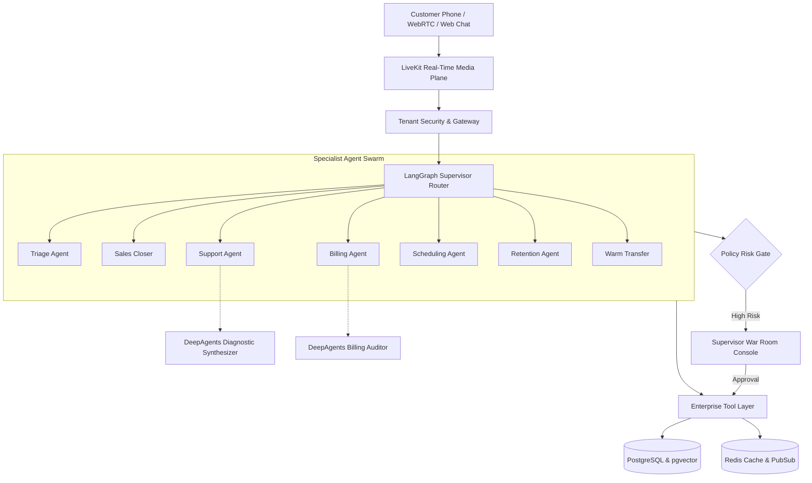

# Omniweb AI — Architecture & Engineering Documentation Hub

Welcome to the central engineering documentation for **Omniweb AI Autonomous Contact Center**. This directory houses formal specifications, architectural decision records, migration roadmaps, and deployment runbooks.

---

## 📚 Documentation Index

### 1. Architecture Specifications
- **[Target State Architecture (Approved)](./architecture/target-state.md)** — Comprehensive specification of the 4-plane agentic contact center, state schema (`ContactCenterState`), LiveKit voice transport, tool registry, and supervisor governance.
- **[Current State Assessment](./architecture/current-state.md)** — Technical inventory, legacy code assessment, database model review, and technical debt analysis.
- **[Phased Migration Plan](./architecture/migration-plan.md)** — 11-phase incremental modernization strategy with feature flag definitions.

---

### 2. Architectural Decision Records (ADRs)

| ADR ID | Title | Status | Scope |
|---|---|---|---|
| **[ADR-001](./adr/ADR-001-agent-orchestration.md)** | Layered Agent Orchestration Architecture | Accepted | 4-Plane Separation of Concerns |
| **[ADR-002](./adr/ADR-002-livekit-realtime.md)** | Real-Time Audio Transport via LiveKit | Accepted | WebRTC / SIP Telephony Media Plane |
| **[ADR-003](./adr/ADR-003-langgraph-workflows.md)** | Durable Workflows with LangGraph | Accepted | Stateful Conversation Graphs & Checkpointing |
| **[ADR-004](./adr/ADR-004-deepagents-delegation.md)** | Long-Horizon Delegation with DeepAgents | Accepted | Asynchronous Multi-Step Background Tasks |
| **[ADR-005](./adr/ADR-005-google-adk.md)** | Google Agent Development Kit & Gemini 2.0 | Accepted | Multimodal Grounding & Tool Integration |
| **[ADR-006](./adr/ADR-006-model-routing.md)** | Dynamic Model Routing | Accepted | Cognitive Tier Routing (Flash vs Pro vs Fallback) |
| **[ADR-007](./adr/ADR-007-memory.md)** | Tiered Agent Memory Architecture | Accepted | Episodic, Semantic & Entity Memory |
| **[ADR-008](./adr/ADR-008-multitenancy.md)** | Multi-Tenancy & Tenant Data Isolation | Accepted | Tenant Boundaries, RAG Isolation & RBAC |
| **[ADR-009](./adr/ADR-009-human-in-loop.md)** | Human-in-the-Loop & Supervisor Console | Accepted | Policy Engine & Live Approval Workflow |
| **[ADR-010](./adr/ADR-010-gcp-deployment.md)** | Production Deployment on GCP | Accepted | GCP Compute Engine VM, Cloud Run & Cloud SQL |

---

## 🔍 Architecture Overview Diagram

---

## 🛠 Developer Quick Links

- **Main Project Readme:** [`../README.md`](../README.md)
- **Deployment Script:** [`../scripts/deploy-gcp-vm.sh`](../scripts/deploy-gcp-vm.sh)
- **Docker Compose Stack:** [`../docker-compose.gcp.yml`](../docker-compose.gcp.yml)
- **Backend Entrypoint:** [`../backend/app/main.py`](../backend/app/main.py)
