# Target Architecture: Omniweb Agentic AI Customer Operations Platform

## 1. Architectural Philosophy
> **"Omniweb agents should not merely answer customers. They should safely execute customer operations."**

The platform transitions from a voice/receptionist tool into an enterprise-grade, multi-tenant autonomous operations platform where:
1. LLMs **propose** actions; deterministic application code **authorizes and executes** them.
2. Structured databases hold authoritative business state; vector indexes supply semantic grounding.
3. Every consequential write is validated, bounded by policy, checked for idempotency, and auditable.
4. Human operators can inspect, approve, modify, or take over workflows seamlessly.

---

## 2. End-to-End Conceptual Flow

```mermaid
graph TD
    subgraph Channels ["1. Inbound Customer Channels"]
        Voice[LiveKit Voice / Telephony SIP]
        Chat[Web Chat / In-App Widget]
        SMS[SMS / Twilio]
        API[Partner / CRM Webhook API]
    end

    subgraph Gateway ["2. Conversation Gateway"]
        Auth[Tenant Resolution & Auth]
        IDRes[Identity Resolution Layer: KNOWN / PROBABLE / UNKNOWN]
        SessionMgr[Session & Working Memory Manager]
    end

    subgraph Guardrails ["3. Security & Input Guard Layer"]
        PromptGuard[Prompt Injection & Jailbreak Filter]
        PIIGuard[PII Masking & Sanitization]
    end

    subgraph Supervisor ["4. Supervisor / Router Agent (LangGraph)"]
        Intent[Intent & Context Classification]
        PolicyRouter[Workflow Selection & Policy Enforcement]
    end

    subgraph Specialists ["5. Specialist Agent Fleet"]
        AccountAgent[Customer Account Agent]
        BillingAgent[Billing & Refunds Agent]
        SchedulingAgent[Scheduling & Calendar Agent]
        SupportAgent[Technical Support Agent]
        CaseAgent[Case Management Agent]
        EscalateAgent[Human Escalation Agent]
    end

    subgraph ExecutionPipeline ["6. Tool Execution & Governance Pipeline"]
        SchemaVal[Schema & Parameter Validation]
        AuthZ[RBAC & Capability Check]
        PolicyCheck[Deterministic Policy Engine]
        RiskClass[Risk Classification: READ / WRITE / SENSITIVE]
        ApprovalGate[Human-in-the-Loop Approval Gate]
        IdempotencyGate[Idempotency Key Check]
        AdapterExec[Enterprise Adapter Execution]
        ResultVal[Output Grounding & Validation]
        AuditLog[Immutable Audit Trail Generation]
    end

    subgraph Adapters ["7. Enterprise Adapter Layer"]
        CRMAdapter[CRM Adapter: HubSpot / Salesforce / Postgres]
        BillingAdapter[Billing Adapter: Stripe / Shopify]
        CalAdapter[Calendar Adapter: Google / Cal.com]
        TicketAdapter[Ticketing: Zendesk / Jira / Internal]
    end

    Channels --> Gateway
    Gateway --> Guardrails
    Guardrails --> Supervisor
    Supervisor --> Specialists
    Specialists --> ExecutionPipeline
    ExecutionPipeline --> Adapters
```

---

## 3. Core System Components

### 3.1 Conversation Gateway & Identity Resolution
- Channels feed into a unified `ConversationSession`.
- **Identity Resolver**: Resolves incoming channel identifiers (phone number, email, browser session, customer token) into a canonical `CustomerIdentity`.
  - States: `KNOWN` (verified authentication or phone OTP), `PROBABLE` (matching phone/email without cryptographic token), `UNKNOWN` (anonymous web visitor).
  - Sensitive operations (e.g. refunds, address changes) strictly require `KNOWN` status.

### 3.2 Supervisor & Specialist Multi-Agent Hierarchy
Orchestrated via a single LangGraph state machine with strict typed state (`CustomerOperationState`).
1. **Supervisor Agent**: Reads input, identifies intent, retrieves short-term memory, and delegates control to a specialist.
2. **Customer Account Agent**: Read/update customer details, address verification, notification preferences.
3. **Billing Agent**: Look up invoices, payments, subscriptions; propose refunds or adjustments (bounded by policy).
4. **Scheduling Agent**: Calendar availability, booking, rescheduling, cancellations.
5. **Support Agent**: Tenant-scoped RAG retrieval, troubleshooting steps, diagnostic guidance.
6. **Case Management Agent**: Create, update, tag, prioritize, and close customer operation cases.
7. **Escalation Agent**: Collects summary, pending state, and packages context for human operator takeover.

### 3.3 Four-Tier Memory Architecture
- **Tier A — Working Memory**: Current LangGraph execution state (`CustomerOperationState`), checkpointed in Redis.
- **Tier B — Session Memory**: Ephemeral conversational history, recent turns, and scratchpad data stored in Redis.
- **Tier C — Authoritative Business State**: ACID PostgreSQL tables (`customers`, `accounts`, `cases`, `orders`, `refunds`, `audit_events`).
- **Tier D — Semantic Long-Term Memory**: PostgreSQL + `pgvector` for past conversation summaries, knowledge base documents, and customer preferences.

### 3.4 Tool Execution & Governance Pipeline
Every tool proposal from an LLM passes through a deterministic 9-stage pipeline:
1. **Schema Validation**: Pydantic v2 validates types and constraints.
2. **Authentication Check**: Validates active session and tenant scope.
3. **Authorization Check**: Ensures the calling specialist agent has explicit capability permission (e.g., Scheduling Agent cannot call `issue_refund`).
4. **Business Policy Check**: Evaluated by `PolicyEngine` (e.g., refund > $100 requires manager approval).
5. **Risk Classification**: Categorized as `READ`, `WRITE`, `SENSITIVE_WRITE`, or `EXTERNAL_SIDE_EFFECT`.
6. **Human Approval Gate**: If sensitive/exceeding threshold, enters `AWAITING_APPROVAL` status and notifies the Operations Console.
7. **Idempotency Check**: Hashes tenant ID, customer ID, operation type, and business payload to reject duplicates.
8. **Adapter Execution**: Runs against the target external adapter.
9. **Audit Trail**: Writes an immutable `AuditEvent` with actor, action, previous/new state, and trace ID.

---

## 4. Observability, Tracing & AI Evaluation
- **OpenTelemetry Standard**: Distributed traces spanning incoming HTTP/WebSocket/LiveKit request -> Supervisor -> Specialist Agent -> RAG retrieval -> Tool execution -> DB write.
- **AI Evaluation Suite (`tests/evals/`)**:
  - Regression evaluation dataset covering normal cases, adversarial edge cases, prompt injection attempts, and tool timeouts.
  - Automated evaluation metrics: Intent accuracy, routing precision, groundedness, policy compliance, and duplicate-prevention success.
