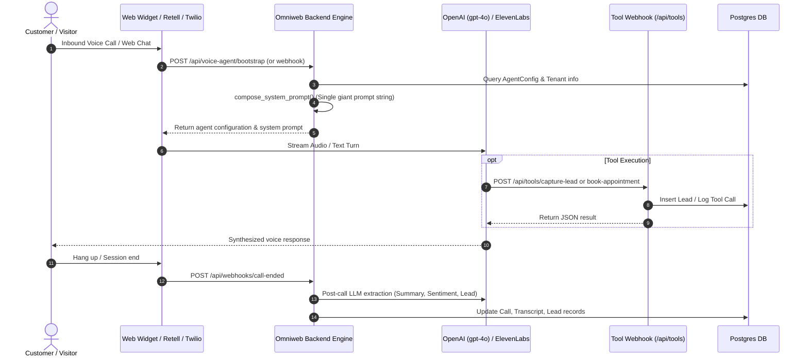

# Omniweb AI — Current State Architecture Assessment

**Date:** 2026-08-30  
**Status:** Completed Assessment  
**Author:** Principal Agentic AI Architect & Staff Systems Engineer  

---

## 1. System Overview

Omniweb AI is currently a hybrid Next.js frontend and multi-backend platform designed for single-receptionist voice and text assistant capabilities. The codebase is organized across three primary application tiers:

1. **Frontend App (`/` root Next.js 16.2 / React 19):**
   - Marketing site with 30+ vertical landing pages, pricing grids, and hero video presenter.
   - Tenant Dashboard (`/dashboard`) managing business profile, widget installation, telephony configuration, lead inbox, and basic analytics.
   - Client Auth via Clerk (primary) + engine token exchange, with fallback to local JWT cookies.
   - Dual-persistence layer: Connects via PostgreSQL (`pg`) for SaaS profile storage and calls the backend engine API for runtime operations.

2. **Backend Agent Engine (`backend/` FastAPI 0.115 / Python 3.12):**
   - Main multi-tenant data plane and integration bridge.
   - Relational persistence using SQLAlchemy 2.0 (asyncio + asyncpg) with Alembic migrations.
   - Voice and telephony transport delegated to external providers: ElevenLabs Conversational AI, Retell AI, and Deepgram Agent API.
   - Tool calling via webhook endpoints (`/api/tools/*`) authenticated with shared secrets.
   - Stripe billing webhooks, Twilio number purchasing and SMS sending, Cal.com scheduling integrations, and Shopify storefront OAuth integration.

3. **Auxiliary AI Microservice (`ai/` FastAPI):**
   - Lightweight FastAPI service containing rule-based intent matching, page navigation actions, and legacy conversation endpoints.
   - Standalone `agent/agent.py` placeholder (currently 0 bytes).

---

## 2. Technology Inventory

| Layer | Technologies & Libraries | Current Role | Status / Assessment |
|---|---|---|---|
| **Frontend Framework** | Next.js 16.2.0 (App Router), React 19.2.4, TypeScript 5.7 | Web app, marketing pages, tenant dashboard | Modern, robust, fully reusable |
| **Styling & UI** | Tailwind CSS v4, Radix UI primitives, Lucide React, Framer Motion | Design system, glassmorphism panels, modals | High quality, fully reusable |
| **Frontend Auth** | `@clerk/nextjs` 7.1, `@clerk/themes` 2.4 | Tenant sign-up, sign-in, user identity | Production-ready, maintain as tenant identity |
| **Frontend DB Client** | `pg` 8.20 (node-postgres Pool) | Local Next.js direct Postgres queries for `omniweb_tenants` | Redundant with backend engine; should be consolidated |
| **Backend Framework** | FastAPI 0.115.0, Uvicorn, Pydantic v2 | Main Agent Engine API (`backend/`) | Clean, modular, production-grade base |
| **ORM / Migrations** | SQLAlchemy 2.0.0 (asyncpg), Alembic 1.13.0 | PostgreSQL database schema, migrations | Solid foundation for contact center state & models |
| **Cache & Queue** | Redis 5.0+, ARQ 0.26 | Job queue for post-call tasks & async processing | Ready for durable event processing |
| **Voice Transport** | ElevenLabs ConvAI, Retell AI, Deepgram Nova-3 | Telephony & WebRTC voice media | Fragmented across 3 providers; needs LiveKit consolidation |
| **LLM Orchestration** | Raw OpenAI client (`openai.AsyncOpenAI`) calling `gpt-4o` | Post-call summarization, brain prompts | Single-agent, prompt-stitched; lacks LangGraph workflow state |
| **RAG / Vector DB** | Supabase pgvector (referenced in config) / ElevenLabs KB | Website knowledge scraping | Fragmented; lacks tenant-isolated semantic chunking |
| **Telephony / SMS** | Twilio Python SDK 9.0 | Number purchasing, SMS dispatch | Reusable for SIP trunking and SMS channels |
| **Payments** | Stripe SDK 10.0 | Subscription checkout, billing webhooks | Reusable and functioning |
| **Deployment / Infra**| DigitalOcean App Platform (`.do/app.yaml`), Docker | Multi-container deployment | Functional, will map directly to GCP Cloud Run / Cloud SQL |

---

## 3. Existing AI / Receptionist Execution Flow

### Limitations of Current Flow:
1. **Single Monolithic Prompt:** The entire persona, knowledge, business rules, qualification logic, and guardrails are concatenated into one large prompt string (`prompt_engine.py`).
2. **No Stateful Orchestrator:** The conversation lacks a durable state machine. If a call drops or requires a multi-step investigation, the state is lost.
3. **No Specialist Swarm:** One agent attempts to handle sales, emergency triage, billing, scheduling, and support simultaneously without role boundaries.
4. **No Long-Horizon Delegation:** Complex tasks (such as historical billing audits or multi-system lookups) cannot be handed off to asynchronous deep research agents.
5. **No Structured Human-in-the-Loop:** High-risk actions (discounts, refunds, cancellations) rely on prompt compliance rather than a deterministic policy engine with pause/resume approval gates.
6. **Provider Fragmentation:** Transport logic is scattered across ElevenLabs, Retell, and Deepgram endpoints instead of a unified LiveKit interaction plane.

---

## 4. Current Database Model Assessment

The existing PostgreSQL schema (`backend/app/models/models.py`) contains 18 models:
- `Client` (Tenants, auth, Clerk IDs, billing status, embed codes)
- `AgentConfig` (Single-agent configuration, prompt settings, business hours)
- `PhoneNumber` (Twilio phone numbers)
- `Call`, `Transcript`, `Lead`, `Engagement`, `FollowUpTask`, `SmsMessage`, `OutreachSequence`
- `TenantChannel`, `TenantRetellAgent`, `TenantCallLog`, `TenantUsageMetering`, `TenantEscalationRule`
- `ShopifyStore`, `ShopifyAssistantSession`, `ShopifyDiscountApproval`
- `ToolCallLog`, `AgentTemplate`, `SiteTemplateInstance`

**Strengths:**
- Native PostgreSQL UUID primary keys and extensive foreign key cascading.
- Strong indexing across `client_id`, `created_at`, `phone_number`, and `status`.
- Dedicated audit log table (`ToolCallLog`) and usage metering tables.

**Gaps for Agentic Contact Center:**
- Missing `Customer` / `Contact` master record (leads exist, but no persistent customer entity across interactions).
- Missing `AgentExecution` and `WorkflowCheckpoint` tables for LangGraph state persistence.
- Missing `Approval` entity for human-in-the-loop governance.
- Missing `KnowledgeDocument` and `KnowledgeChunk` tables with pgvector embeddings for tenant-isolated RAG.
- Missing `Campaign`, `ContactList`, and `CallAttempt` models for outbound dialer operations.

---

## 5. Security & Multi-Tenancy Assessment

1. **Tenant Isolation:**
   - Database queries filter by `client_id` in most endpoints.
   - **Risk:** Some public tool webhooks (`/api/tools/*`) resolve tenants via `retell_agent_id` or fall back to a default client (`LANDING_PAGE_CLIENT_ID`). Multi-tenant boundaries must be strictly validated per request context without permissive fallbacks.
2. **Secrets & Keys:**
   - Secrets are managed via environment variables.
   - Shared tool secret (`X-Tool-Secret`) is used for webhook verification.
3. **Authentication:**
   - Clerk authentication is verified on the frontend and exchanged via `/api/auth/clerk-session` for an engine JWT.
   - Service-to-service communication uses `INTERNAL_API_KEY`.

---

## 6. Technical Debt & Refactoring Boundaries

1. **Eliminate Dual DB Connections in Frontend:** Next.js currently uses raw `pg` pool queries in `lib/saas/db.ts` alongside API calls to `backend/`. All persistence should be unified through the backend engine REST/RPC APIs.
2. **Consolidate Voice Transport:** Migrate from fragmented Retell/ElevenLabs/Deepgram endpoints to a unified **LiveKit Realtime Interaction Plane**.
3. **Decompose Monolithic Prompts into LangGraph Workflows:** Replace the 700-line `prompt_engine.py` with typed LangGraph state graphs and bounded specialist agents.
4. **Isolate Agent / Tool Contracts with Pydantic & MCP:** Enforce strict parameter validation and policy engine checks on all tool invocations.
