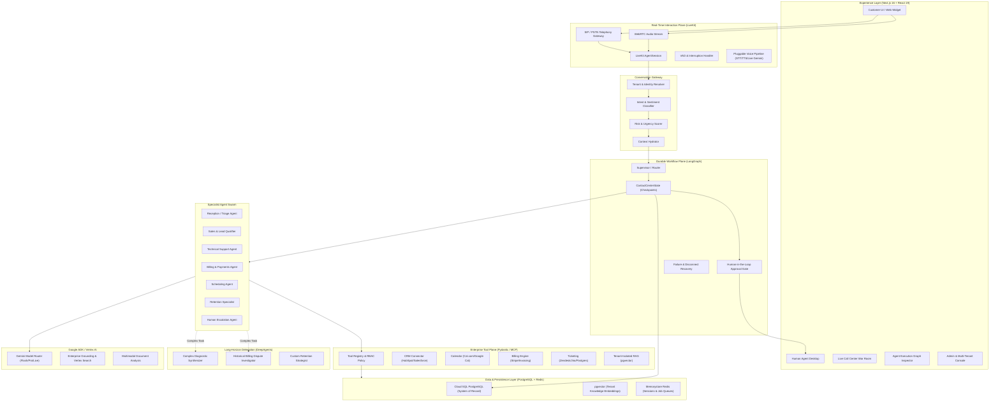

# Omniweb AI — Target State Architecture

**Date:** 2026-08-30  
**Status:** Approved Target Architecture Specification  
**Author:** Principal Agentic AI Architect & Staff Systems Engineer  

---

## 1. Executive Summary

The target state transforms Omniweb AI from a single-agent receptionist into a multi-tenant **Autonomous Agentic AI Contact Center** operating across four strictly decoupled architectural planes:

1. **Real-Time Interaction Plane (LiveKit):** Manages WebRTC audio, SIP telephony, VAD, turn-detection, and low-latency audio transport (< 300ms).
2. **Durable Workflow Plane (LangGraph):** Owns stateful conversation flows, intent classification, agent routing, checkpointing, retries, and human-in-the-loop gates.
3. **Long-Horizon Delegation Plane (DeepAgents):** Executes multi-stage research, billing dispute audits, technical diagnostic synthesis, and retention planning.
4. **Specialist Agent Services & Intelligence (Gemini / Vertex AI & Google ADK):** Powers Gemini 2.0 / 1.5 Pro multimodal reasoning, model routing, and Google-native agent tools.

---

## 2. High-Level Target Architecture



---

## 3. Contact Center State Model (`ContactCenterState`)

All durable conversational and business workflows in LangGraph are governed by the strictly typed state model:

```python
from typing import TypedDict, Literal, Any
from datetime import datetime

class ContactCenterState(TypedDict):
    tenant_id: str
    session_id: str
    interaction_id: str
    channel: Literal["phone_inbound", "phone_outbound", "browser_voice", "web_chat", "sms", "whatsapp"]

    # Customer Identity & Security
    customer_id: str | None
    caller_phone: str | None
    caller_email: str | None
    identity_verified: bool
    authentication_level: Literal["anonymous", "caller_id_verified", "mfa_authenticated"]

    # Classification & Intent
    language: str
    intent: str | None
    secondary_intents: list[str]
    sentiment: Literal["delighted", "positive", "neutral", "frustrated", "angry"] | None
    urgency: Literal["low", "medium", "high", "critical"] | None
    risk_level: Literal["standard", "elevated", "high_risk"]

    # Agent Swarm Execution
    active_agent: str
    previous_agents: list[str]
    workflow_name: str | None
    workflow_step: str | None

    # Context & Entities
    conversation_summary: str
    messages: list[dict[str, Any]]
    entities: dict[str, Any]
    account_context: dict[str, Any]
    customer_context: dict[str, Any]

    # Action & Policy Governance
    requested_actions: list[dict[str, Any]]
    completed_actions: list[dict[str, Any]]
    pending_actions: list[dict[str, Any]]
    approval_required: bool
    approval_status: Literal["pending", "approved", "rejected", "expired"] | None

    # Escalation
    escalation_required: bool
    escalation_reason: str | None

    # Audit & Tool Tracing
    tool_results: dict[str, Any]
    errors: list[dict[str, Any]]

    started_at: datetime
    updated_at: datetime
```

---

## 4. Multi-Agent Team Specifications

| Agent Name | Primary Scope | Allowed Tools | Denied Tools | Escalation / Approval Triggers |
|---|---|---|---|---|
| **Reception / Triage** | Greeting, language detection, intent discovery, routing | `kb.search`, `tenant.get_hours`, `crm.lookup_customer` | Any mutation tool, payments, refunds | Hostility, unknown high-urgency request |
| **Customer Account** | Identity verification, profile view/update, service status | `customer.get_profile`, `customer.update_address`, `mfa.send_otp` | Credit issuance, subscription cancellation | MFA failure, unauthorized data access attempt |
| **Billing & Payments** | Invoice review, balance inquiry, payment processing, disputes | `billing.get_invoices`, `billing.create_payment_link`, `billing.request_refund` | Direct refund > $50 without approval | Refunds > $50, chargeback disputes, rate changes |
| **Sales & Closer** | Lead qualification, product recommendations, proposals | `crm.create_lead`, `crm.enrich_lead`, `catalog.get_pricing` | System config, customer account edits | Unqualified high-volume enterprise inquiries |
| **Scheduling** | Appointment booking, rescheduling, cancellations | `calendar.get_availability`, `calendar.book_slot`, `sms.send_confirmation` | Billing mutation, discount creation | Double-booking conflict, VIP request |
| **Technical Support** | Issue diagnostics, troubleshooting scripts, ticketing | `kb.search_troubleshooting`, `tickets.create`, `diagnostics.run_check` | Account deletion, billing refunds | Hardware failure, critical downtime |
| **Retention** | Cancellation defense, approved incentive offers | `retention.get_approved_offers`, `retention.apply_credit` | Unauthorized custom discounting | Customer insists on final cancellation |
| **Human Escalation** | Warm transfer with JSON context briefing | `telephony.transfer_call`, `telephony.conference_agent` | Autonomous resolution | Live agent acceptance |

---

## 5. LiveKit Voice Pipeline Design

```text
[Inbound Audio WebRTC / SIP]
            │
            ▼
   LiveKit AgentSession
   ├── VAD (Silero / WebRTC VAD)
   ├── Turn Detection & Interruption Monitor
   └── Audio Pipeline Selection:
       ├── Pipeline A: Deepgram Nova-3 STT ➔ LangGraph / Gemini ➔ Cartesia / ElevenLabs TTS
       └── Pipeline B: Gemini 2.0 Multimodal Realtime Voice (Direct Audio-to-Audio)
            │
            ▼
    LangGraph Bridge Event
    (Transcribed Text + Audio Turn Timestamp + Voice Tone Analysis)
            │
            ▼
    LangGraph State Graph Execution
            │
    (Agent Brain Reason + Tool Call + Checkpoint)
            │
            ▼
    LiveKit TTS Stream Output back to Caller
```

---

## 6. Enterprise Tool Layer & MCP Registry

Tools are registered with explicit Pydantic schemas, risk classification, tenant constraints, and idempotency guarantees:

```text
backend/app/tools/
├── registry.py           # Tool registry, RBAC decorator, and execution logger
├── crm/                  # Customer & Lead management
├── billing/              # Invoices, transactions, refund requests
├── calendar/             # Availability querying and booking
├── ticketing/            # Support ticket creation and updates
├── knowledge/            # Tenant-isolated RAG vector search
└── communications/       # SMS, Email, and Push notifications
```

---

## 7. Human-in-the-Loop & Supervisor War Room

- Actions classified as `HIGH_RISK` (such as issuing refunds > $50, canceling subscriptions, or changing contract rates) enter `PENDING_APPROVAL` status.
- LangGraph checkpoints the conversation state and emits an `ApprovalRequested` event to the Redis/PubSub bus.
- The Supervisor War Room UI (`/dashboard/call-center`) alerts the supervisor with full conversational context, caller profile, and the proposed agent tool payload.
- Upon supervisor `Approve` or `Reject`, LangGraph resumes execution seamlessly from the checkpoint.
